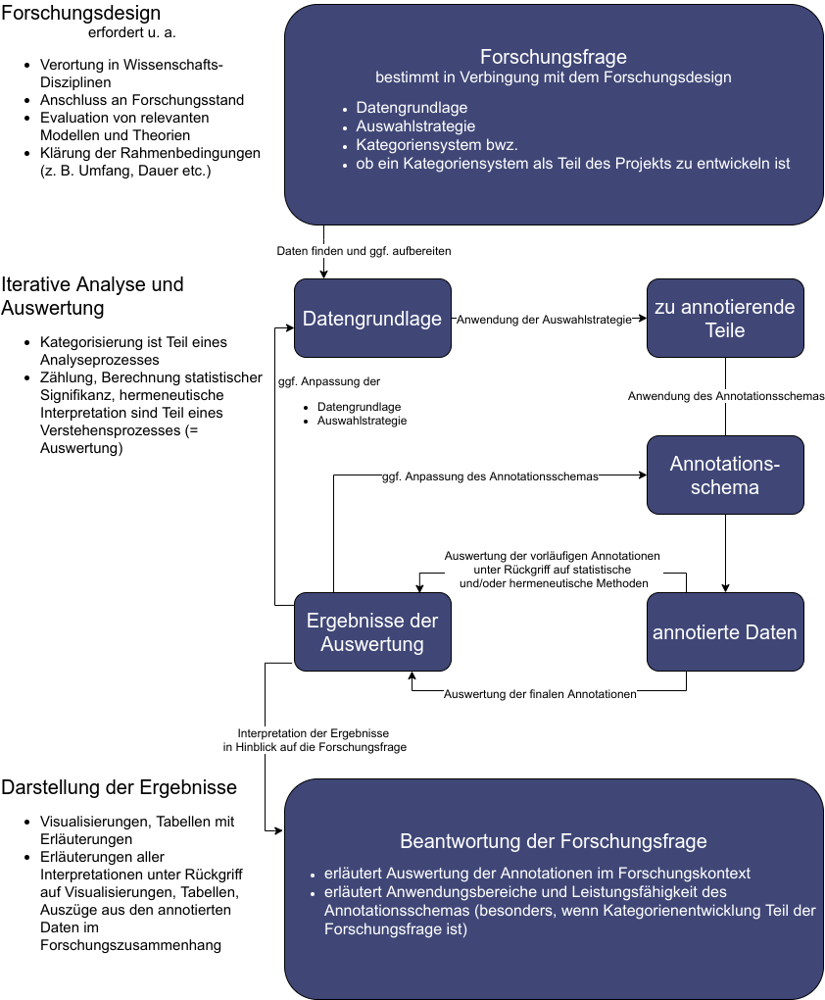
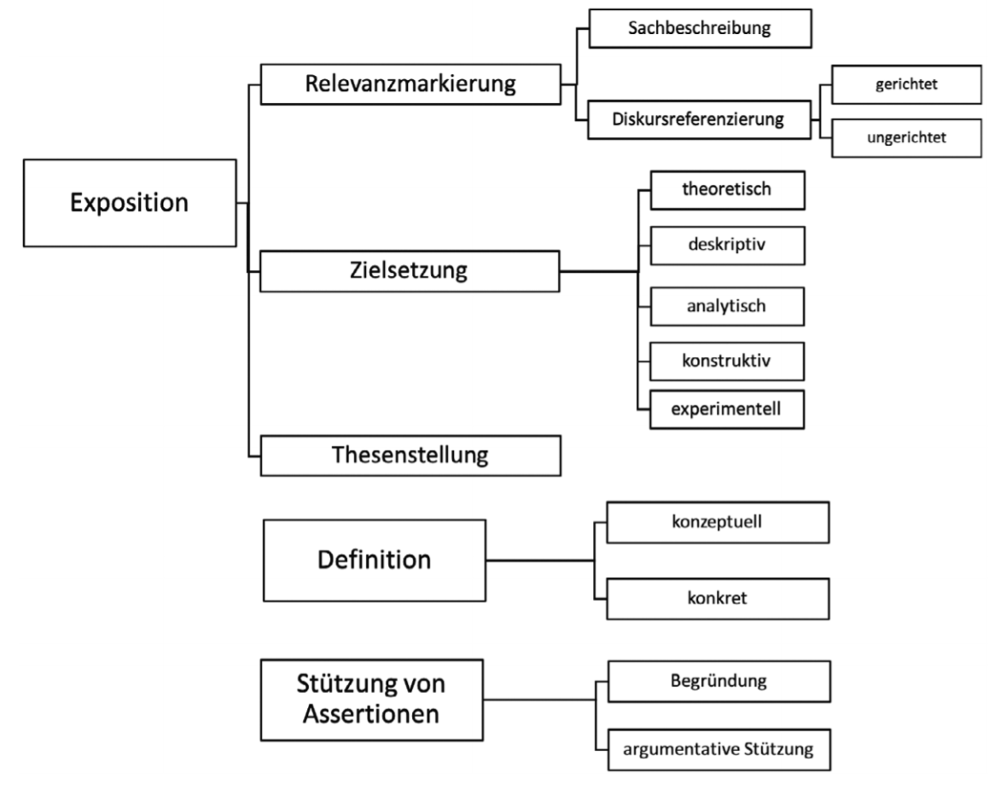
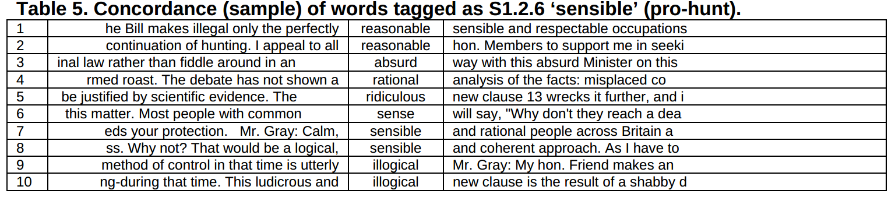
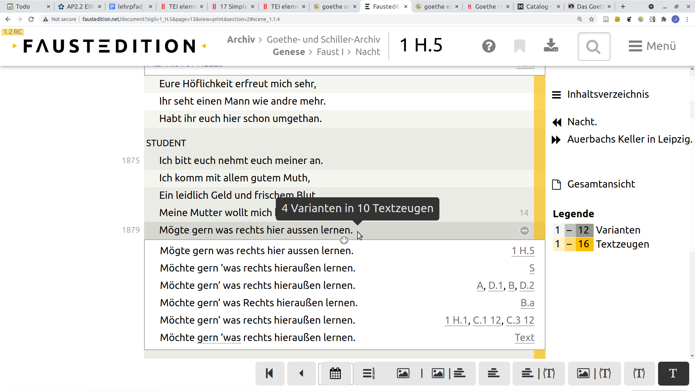
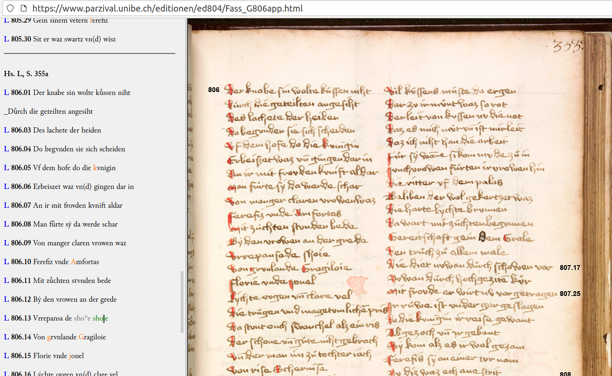
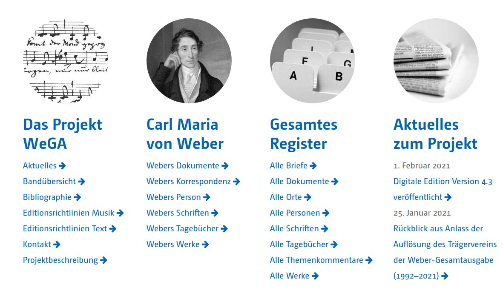
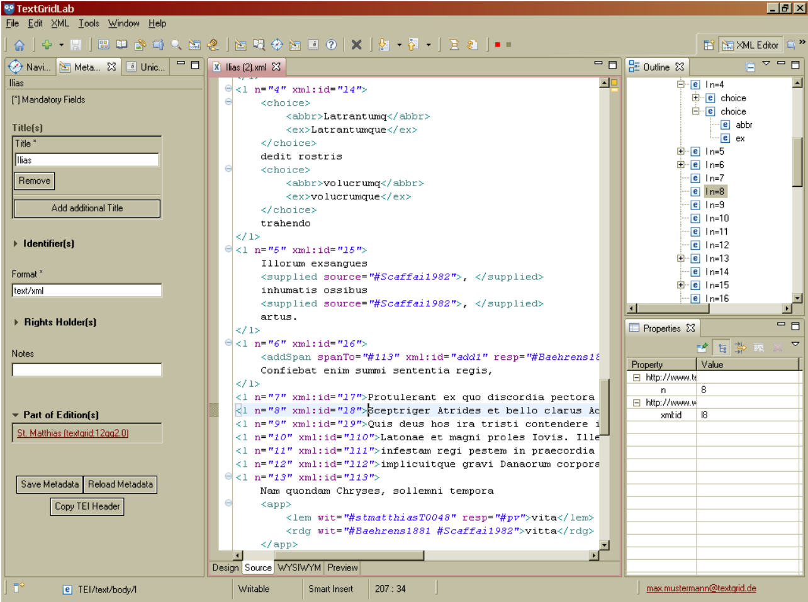
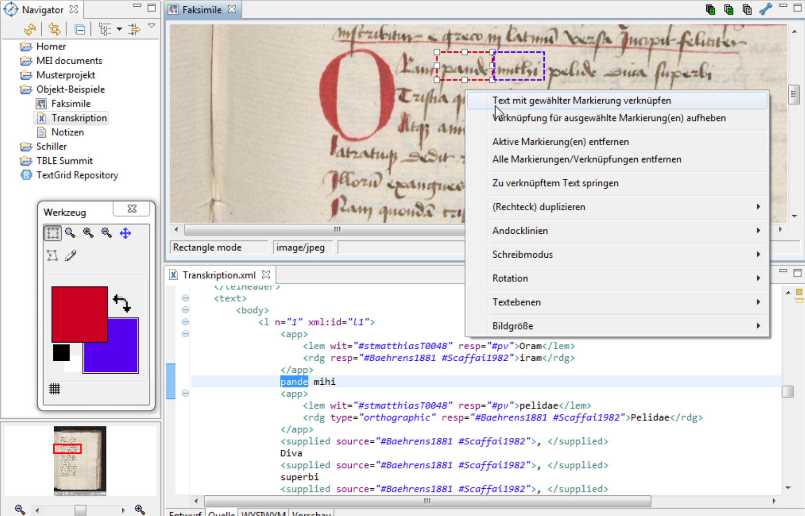
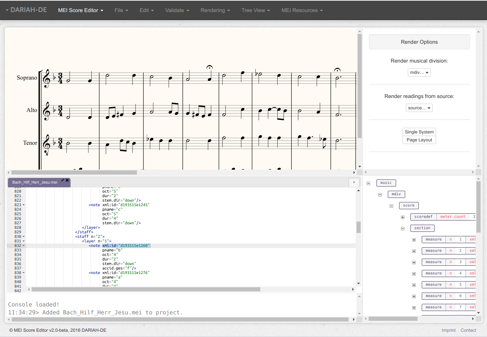
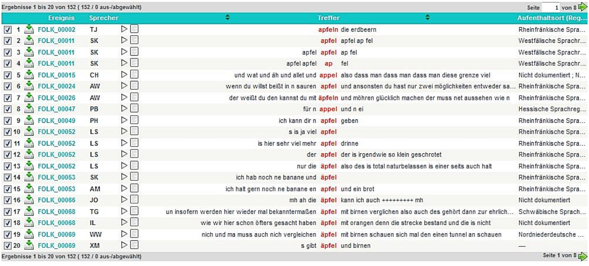

<!-----
NEW: Check the "Suppress top comment" option to remove this info from the output.

Conversion time: 6.256 seconds.

Using this Markdown file:

1. Paste this output into your source file.
2. See the notes and action items below regarding this conversion run.
3. Check the rendered output (headings, lists, code blocks, tables) for proper
   formatting and use a linkchecker before you publish this page.

Conversion notes:

* Docs to Markdown version 1.0β31
* Wed Sep 01 2021 03:33:38 GMT-0700 (PDT)
* Source doc: lehrpfad_annotation (final für export)

ERROR:
undefined internal link to this URL: "#heading=h.hj1uapampiiu".link text: unten
?Did you generate a TOC?

ERROR:
undefined internal link to this URL: "#heading=h.czlj65ryqxr1".link text: automatische Annotation
?Did you generate a TOC?

* Tables are currently converted to HTML tables.
* This document has images: check for >>>>>  gd2md-html alert:  inline image link in generated source and store images to your server. NOTE: Images in exported zip file from Google Docs may not appear in  the same order as they do in your doc. Please check the images!

WARNING:
You have 5 H1 headings. You may want to use the "H1 -> H2" option to demote all headings by one level.

----->

>>>>>  gd2md-html alert:  ERRORs: 2; WARNINGs: 1; ALERTS: 13.

<ul style="color: red; font-weight: bold"><li>See top comment block for details on ERRORs and WARNINGs. <li>In the converted Markdown or HTML, search for inline alerts that start with >>>>>  gd2md-html alert:  for specific instances that need correction.</ul>

Links to alert messages:
<a href="#gdcalert1">alert1</a>
<a href="#gdcalert2">alert2</a>
<a href="#gdcalert3">alert3</a>
<a href="#gdcalert4">alert4</a>
<a href="#gdcalert5">alert5</a>
<a href="#gdcalert6">alert6</a>
<a href="#gdcalert7">alert7</a>
<a href="#gdcalert8">alert8</a>
<a href="#gdcalert9">alert9</a>
<a href="#gdcalert10">alert10</a>
<a href="#gdcalert11">alert11</a>
<a href="#gdcalert12">alert12</a>
<a href="#gdcalert13">alert13</a>

>>>>> PLEASE check and correct alert issues and delete this message and the inline alerts.

# Lehrpfad Annotation

# **1 Einleitung**

## **1.1 Ziele**

Dieser Lehrpfad führt in Annotation als zentrale Methode der digitalen Geisteswissenschaften ein (s. Abschnitt [3](#bookmark=id.giqoczyu51sv)) und stellt die wichtigsten Annotationsarten und eine Auswahl der dafür zur Verfügung stehenden digitalen Werkzeuge vor (s. Abschnitt [4](#bookmark=id.j2bj1jl0q501)). Eines der Hauptziele des Lehrpfades ist es, nicht nur bei der Auswahl geeigneter Werkzeuge und Annotationsarten zu helfen, sondern auch die Projektplanung zu unterstützen. Hierfür werden wir in Abschnitt [2](#bookmark=id.lhufksmixy87) zeigen, wie Annotationsarbeiten in ein Forschungsprojekt integriert werden können.

## **1.2 Zielgruppe**

Der Einsatz digitaler Werkzeuge und auf digitalen Daten ruhenden Analysemethoden ist sehr zeitintensiv. Daher wendet sich dieser Lehrpfad in erster Linie an Doktorand_innen oder PostDocs mit oder ohne Erfahrung mit dem Einsatz digitaler Werkzeuge und an Master- bzw. Bachelorkandidat_innen mit Erfahrung mit dem Einsatz digitaler Werkzeuge. In allen Fällen ist eine genaue Absprache mit den jeweiligen Professor_innen unerlässlich, bei der der Stellenwert der digitalen Komponenten festgelegt wird. Legen die Professor_innen nur wenig Wert auf den digitalen Teil, muss dies in der Konzeption und Durchführung des Projekts berücksichtigt werden, was also heißt, dass er nur wenig Zeit in Anspruch nehmen darf. Dies ist vor allem dann sehr schwierig, wenn kaum oder keine Erfahrung mit digitalen Werkzeugen und Methoden vorliegt.

## **1.3 Übungsmaterialien und didaktisches Konzept**

Da Annotation als Basismethode für sehr unterschiedliche Forschungsinteressen und -fragen geeignet ist und auf sehr unterschiedliche Arten zum Einsatz kommt, können nicht zu allen Arten und Werkzeugen Übungen erstellt werden. Als Ersatz für einzelne Übungen wählen wir die Veranschaulichung durch ausgewählte Beispiele aus der Forschung.

# **2 Annotation als Arbeitsphase in einem Forschungsprojekt**

Annotation, also die Anreicherung von Information mit Zusatzinformation (Näheres s. 

>>>>>  gd2md-html alert: undefined internal link (link text: "unten"). Did you generate a TOC?  (<a href="#">Back to top</a>)(<a href="#gdcalert2">Next alert</a>) >>>>> 

[unten](#heading=h.hj1uapampiiu)) wird immer dann eingesetzt, wenn eine Fragestellung nicht anhand der Textoberfläche bearbeitet werden kann. 

## **2.1 Beispiel 1: Häufigkeit bestimmter Wortarten**

So ist zum Beispiel die Frage "Wie häufig verwendet ein_e Autor_in attributive Adjektive" nur dann bearbeitbar, wenn jedem Wort zugeordnet wird, welcher Wortart es angehört. Allerdings ist diese Frage noch ohne großen wissenschaftlichen Wert, da sie keine nennenswerte Hypothese enthält. Die Fragestellung muss also erweitert werden, z. B. um die Hypothese, dass erfahrene Autor_innen attributive Adjektive nur sparsam einsetzen. Als Thema ließe sich das dann so ausdrücken: "Aus Erfahrung sparsam: Häufigkeit des Gebrauchs attributiver Adjektive im Vergleich zwischen Früh- und Spätwerk". Die Auszeichnung der Wörter mit Wortarten genügt nun nicht mehr, es muss zusätzlich noch das Entstehungsdatum der zu untersuchenden Texte annotiert werden. Viele Texte mit Wortartinformation und Veröffentlichungsdatum auszuzeichnen ist heutzutage nicht sehr zeitaufwendig, da es genügend verlässliche digitale Tools ("Tagger") für die 

>>>>>  gd2md-html alert: undefined internal link (link text: "automatische Annotation"). Did you generate a TOC?  (<a href="#">Back to top</a>)(<a href="#gdcalert3">Next alert</a>) >>>>> 

[automatische Annotation](#heading=h.czlj65ryqxr1) von Texten mit basalen linguistischer Kategorien gibt. Auch das Veröffentlichungsdatum kann normalerweise bereits bei der Recherche nach den Texten praktisch nebenbei vermerkt werden. 

## **2.2 Beispiel 2: Zuordnung von Eigenschaften zu Figuren**

Anders liegt der Fall bei einer Fragestellung wie "Welche Eigenschaften werden Jungen und Mädchen in Kinderbüchern zugeschrieben?". Diese Fragestellung kann nur mit deutlich höherem Zeitaufwand bearbeitet werden. Zum einen muss definiert und am besten in einer Pilotstudie geprüft werden, was unter "Zuschreibung von Eigenschaften" verstanden wird und wie diese Zuschreibungsarten erkannt werden können. Die Granularität der Auszeichnung muss ebenso geklärt werden wie die Berücksichtigung formaler Ko-Text-Merkmale. So kann es einen Unterschied machen, ob Eigenschaften durch Figurenrede (z. B. _"Du bist immer so feige", sagte er zu ihm_), durch explizite Mitteilung des Autors (_Hans war ein Draufgänger_) oder durch Figurenhandeln mit und ohne explizite Wertung (ohne Wertung: _Sie ging in das brennende Haus und trug den Hund ins Freie_; mit Wertung: _Sie ging furchtlos in das brennende Haus und trug den Hund ins Freie_) zugeschrieben werden. Die so entstehenden Kategorien müssen [manuell annotiert](#bookmark=id.4d90uywmqbbv) werden, was einen ungleich höheren Zeitaufwand mit sich bringt als die Nutzung eines Taggers.

Auch die Auswertung der Annotation weicht in den beiden Beispielen voneinander ab. Im ersten Beispiel müssen in einem ersten Schritt zwar lediglich die Häufigkeiten der Adjektive für einen bestimmten Zeitraum ermittelt werden. Allerdings genügt das noch nicht, um die Fragestellung zu beantworten, selbst wenn die Häufigkeiten im Spätwerk geringer sind als im Frühwerk. Die Signifikanz der Frequenzunterschiede muss berechnet und interpretiert werden. Im zweiten Beispiel müssen solche vergleichenden Signifikanztests für alle Kategorien durchgeführt werden. 

In beiden Fällen gilt es auch zu entscheiden, wie die Häufigkeiten und ihre Unterschiede dargestellt werden sollen. Sollen Grafiken verwendet werden, müssen diese in druckfähigen Formaten und Auflösungen erstellt werden können, was wieder einen Zeitaufwand mit sich bringt.

Den Zeitaufwand für die tatsächliche Annotation und alle damit verbundenen Arbeiten möglichst verlässlich zu schätzen, ist eine der wichtigsten Vorarbeiten für eine Dissertation oder Masterarbeit. Daher lohnt es sich, sich diese Schritte möglichst genau vor Augen zu führen, indem sie zumindest ansatzweise durchgeführt werden, bevor man sich auf ein Thema festlegt.

## **2.3 Workflow Annotation in einem Forschungsprojekt **

>>>>>  gd2md-html alert: inline image link here (to images/image1.png). Store image on your image server and adjust path/filename/extension if necessary.  (<a href="#">Back to top</a>)(<a href="#gdcalert4">Next alert</a>) >>>>> 

[Einbettung von Annotationsarbeiten in ein Forschungsprojekt]

# **3 Annotation in den Geisteswissenschaften**

            

Annotation is one of the most important scholarly primitives in the humanities […]. Annotation tools can demonstrate, perhaps like no other tool can, the usefulness of bringing the digital into the humanities. (Meister 2015 15:20 min)

## **3.1 Annotation: Anreicherung mit Zusatzinformation**

"[Annotation is] the act of creating associations between distinct pieces of information […]" (W3C 2014) oder, etwas weniger allgemein, "the activity of making information about a digital object explicit by adding, e.g., comments, metadata or keywords to a digitized representation or to an annotation file associated with it". (dhtaxonomy/TaDiRAH 2014). Annotation ist also die Anreicherung von Information mit Zusatzinformation und als solches eine zentrale geisteswissenschaftliche Methode, die sehr gut auf digital vorliegende Objekte angewandt werden kann (vgl. Schmunk u. a. 2014). Sowohl Metadaten, also z. B. die Angabe des Autors eines Buches, als auch sehr kleinteilige Zusatzinformationen wie die Wortart eines einzelnen Wortes sind Annotationen in diesem Sinne. Annotationen können automatisch oder manuell durchgeführt werden. Automatische Annotationswerkzeuge sind z. B. Lemmatisierer, die jedem Wort in einem Text die entsprechende Grundform zuordnen. Programme zur manuellen Annotation erlauben es, digital vorliegende Texte, Bilder, Audio- und Videoaufnahmen von Hand mit vorhandenen Klassifizierungssystemen auszuzeichnen oder anhand der Annotationen ein eigenes Klassifizierungssystem zu erstellen.

Um eine Forschungsfrage bearbeiten zu können, müssen nicht zwangsläufig alle Primärdaten –  ein ganzes Textkorpus, ein vollständiges Bild, eine komplette Gesprächsaufnahme etc. – annotiert werden. Vor allem bei manueller Annotation bietet es sich an, gezielt die Teile zu annotieren, die für die Forschungsfrage relevant sind. Die Strategien, wie relevante Teile der Primärdaten identifiziert werden können, hängen dabei vom Medium ab. 

Aus Sicht der Geisteswissenschaften ist Annotation nichts Neues. Im Gegenteil, Notizen und Anmerkungen zu einem Text festzuhalten ist ein grundlegendes traditionelles (geistes-)wissenschaftliches Vorgehen, eines der "scholarly primitives" (Unsworth 2000: 1). Dabei spielt es keine Rolle, ob sie direkt an den Rand in ein Buch geschrieben oder in einem extra dafür angelegten Notizbuch oder Zettelkasten gesammelt werden. Auch Unterstreichungen oder sonstige Hervorhebungen zählen zu diesen gebräuchlichen und analogen Formen der Annotation (vgl. Brockman & Digital Library Federation 2001: 7).

Zusatzinformationen können sich auf ein Digitalisat im Ganzen oder auf Teile davon beziehen. Eher objektive Zusatzinformationen wie Autor und Erscheinungsjahr bei Büchern, Künstler und Erschaffungsjahr bei Kunstwerken oder Fundstelle und vermutliches Alter bei archäologischen Funden werden dabei als "Metadaten" bezeichnet:

    "Metadata is structured information that describes, explains, locates, or otherwise makes it easier to retrieve, use, or manage an information resource. Metadata is often called data about data or information about information." (National Information Standards Organization (U.S.) 2004: 1)

Eher interpretatorische Informationen wie Wortart, Aussage, kultureller Stellenwert o. Ä. werden hingegen als Annotationen bezeichnet. 

    Annotation: Auszeichnung linguistischer Informationen i. d.R. mithilfe einer  Mark-up-Sprache. Hierbei werden dem Primärtext interpretative Analysen auf unterschiedlichen linguistischen Ebenen (Phonetik, Syntax, Semantik, Pragmatik, Diskurs, Stil, Lexik) hinzugefügt. Besondere Annotationen sind Fehlerannotationen in Lernerkorpora sowie die Transkription gesprochener Sprache in Sprachkorpora. (Eintrag „Annotation“: Glück & Rödel 2016)

Dabei ist zu beachten, dass manche Definitionen, wie z. B. die oben angeführte von TaDiRAH, auch Metadaten als (eine Form der) Annotation betrachten.

## **3.2 Annotation: Anwendung vs. Erstellung eines Kategoriensystems**

Annotation kann als Methode aus zwei Richtungen betrachtet werden: Zum einen unterstützen Annotationen den Prozess der Kategorienbildung im Sinne der Erstellung eines Kategoriensystems, zum anderen erlaubt das Annotieren, vorhandene Kategorien in den annotierten Daten explizit zu machen. Vorhandene Kategorien können sich auf alle Dimensionen von Text beziehen, zum Beispiel:

<table>
  <tr>
   <td>Beispiel
   </td>
   <td>Dimension der Zusatzinformation
   </td>
   <td>Bezugsgröße
   </td>
   <td>Beispiel für Kategoriensystem
   </td>
  </tr>
  <tr>
   <td>
<ul>

<li>Autor eines Werks

<li>Veröffentlichungsdatum eines Werks
</li>
</ul>
   </td>
   <td>bibliographisch
   </td>
   <td>konkretes physisches oder nativ digitales Objekt
   </td>
   <td><a href="https://www.dublincore.org/">Dublin Core</a>:
<ul>

<li><em><a href="https://www.dublincore.org/specifications/dublin-core/dcmi-terms/terms/creator/">creator</a></em>

<li><em><a href="https://www.dublincore.org/specifications/dublin-core/dcmi-terms/terms/date/">date</a></em>

<a href="https://tei-c.org/">TEI</a> P5
<ul>

<li><em><a href="https://www.tei-c.org/release/doc/tei-p5-doc/en/html/ref-author.html">author</a></em>

<li><em><a href="https://www.tei-c.org/release/doc/tei-p5-doc/en/html/ref-date.html">date</a></em>
</li>
</ul>
</li>
</ul>
   </td>
  </tr>
  <tr>
   <td>
<ul>

<li>Kapitel

<li>Zeilenumbruch
</li>
</ul>
   </td>
   <td>formale Struktur
   </td>
   <td>Text
   </td>
   <td>TEI:
<ul>

<li><a href="https://www.tei-c.org/release/doc/tei-p5-doc/en/html/ref-div.html">div-Element mit Attribut type= "chapter"</a>

<li><a href="https://www.tei-c.org/release/doc/tei-p5-doc/de/html/ref-lb.html">lb-Element</a>
</li>
</ul>
   </td>
  </tr>
  <tr>
   <td>
<ul>

<li>Pergament

<li>zerrissene Seite
</li>
</ul>
   </td>
   <td>materiale Beschaffenheit
   </td>
   <td>konkretes physisches Objekt
   </td>
   <td>TEI:
<ul>

<li><a href="https://www.tei-c.org/release/doc/tei-p5-doc/de/html/ref-objectDesc.html">material-Element</a>

<li><a href="https://www.tei-c.org/release/doc/tei-p5-doc/de/html/ref-condition.html">condition-Element</a>
</li>
</ul>
   </td>
  </tr>
  <tr>
   <td>
<ul>

<li>verzierte Initiale

<li>Schriftfarbe
</li>
</ul>
   </td>
   <td>ästhetische Beschaffenheit
   </td>
   <td>konkretes physisches oder nativ digitales Objekt
   </td>
   <td>TEI:
<ul>

<li><a href="https://www.tei-c.org/release/doc/tei-p5-doc/de/html/ref-decoNote.html">decoNote-Element</a>

<li><a href="https://www.tei-c.org/release/doc/tei-p5-doc/de/html/ref-rendition.html">rendition-Element</a>
</li>
</ul>
   </td>
  </tr>
  <tr>
   <td>
<ul>

<li>Exposition, Konflikt, Klimax
</li>
</ul>
   </td>
   <td>Erzählstruktur
   </td>
   <td>Text
   </td>
   <td>TEI:
<ul>

<li><a href="https://www.tei-c.org/release/doc/tei-p5-doc/de/html/AI.html#AISP">spanGrp-, span-Element mit Verweis auf xml:id</a>
</li>
</ul>
   </td>
  </tr>
  <tr>
   <td>
<ul>

<li>Protagonist
</li>
</ul>
   </td>
   <td>Figurenanalyse
   </td>
   <td>Text
   </td>
   <td>TEI:
<ul>

<li><a href="https://www.tei-c.org/release/doc/tei-p5-doc/de/html/AI.html#AISP">spanGrp-, span-Element mit Verweis auf xml:id</a>
</li>
</ul>
   </td>
  </tr>
</table>

[mögliche Annotationskategorien; unvollständige Beispielliste]

### **3.2.1 Kategorienbildung durch Annotation**

Die Kategorienbildung dient entweder der Erstellung eines Gold-Standards für automatische Annotation oder der Erstellung einer Taxonomie oder Ontologie. In beiden Fällen ist sie ein vollwertiges Forschungsergebnis. Die Erstellung eines Kategoriensystems auf der Grundlage von Annotationen ist immer ein iterativer Prozess. Zweifelsfälle in der Kategorisierung können zu einer Verfeinerung des Kategoriensystems führen, was eine Prüfung und gegebenenfalls Korrektur der bereits vorgenommenen Annotationen erfordert.

#### **3.2.1.1 Beispiel: "Heuristische Textpraktiken in den Wissenschaften" (Bender & Müller 2020)**

In ihrer Studie analysieren Bender und Müller 

    "Formulierungsverfahren, mit denen in institutionell verankerten Routinen neues Wissen generiert und an vorhandenes Wissen angeschlossen wird, z. B. ‚die Relevanz eines Forschungsthemas markieren‘, ‚einen Begriff definieren‘ oder ‚eine Aussage argumentativ stützen‘. Ziel ist es herauszufinden, in welchem Ausmaß, in welcher Verteilung und mit welcher Kombinatorik solche Textpraktiken in unterschiedlichen wissenschaftlichen Disziplinen vorkommen und welche Effekte fachkulturelle Kontexte auf heuristische Textpraktiken haben." (Bender & Müller 2020: 2)

Um eine solche Studie durchzuführen, bedarf es eines Klassifizierungsschemas, das es ermöglicht, verschiedene Typen heuristischer Textpraktiken zu identifizieren. Da ein solches Schema nicht vorliegt, ist die Entwicklung des Schemas ein unverzichtbarer Teil des Forschungsprojekts und gleichzeitig ein Forschungsergebnis: "Da das Annotationsschema nach unserem Modell der forschenden Annotation bereits ein wichtiges Ergebnis darstellt, präsentieren wir dieses entsprechend im Ergebniskapitel (Kap. 6)." (Bender & Müller 2020: 3) Die Ausgangsbasis bildete ein taxonomisches Annotationsschema (bestehend aus den Basiskategorien _Exposition_, _Definition_ und _Stützung_ von Assertionen), "das aus Kategorien besteht, die aus den theoretischen Vorüberlegungen hergeleitet wurden. Diese  Kategorien grenzen verschiedene in Fachdiskursen konventionalisierte Praktiken der heuristischen Komplexitätsreduktion [...] voneinander ab, also Selektions- und Entscheidungsroutinen [...], die durch bestimmte Ausdrücke indiziert werden." (Bender & Müller 2020: 18)

Das Annotieren von Texten mit solchen Basiskategorien führt zu einer ständigen Überprüfung der Kategorien und ihrer Definitionen. Wird im Verlaufe der Arbeit deutlich, dass die Kategorien nicht ausreichen oder nicht die richtige Analyse-Granularität zulassen, wird das Klassifzierungsschema erweitert. Jede Erweiterung erfordert es, die schon durchgeführten Annotationen zu überprüfen und an das veränderte Schema anzupassen (s. Annotationsschleife in Abbildung "Einbettung von Annotationsarbeiten"). Das Ergebnis dieser Annotationsschleife ist ein in Bezug auf die Forschungsfrage ausgereiftes Kategoriensystem. Die Verfeinerungen der Basiskategorien im Forschungsprojekt von Bender und Müller zeigt die folgende Grafik:

>>>>>  gd2md-html alert: inline image link here (to images/image2.png). Store image on your image server and adjust path/filename/extension if necessary.  (<a href="#">Back to top</a>)(<a href="#gdcalert5">Next alert</a>) >>>>> 

[Kategoriensystem "HeuTex" (Bender & Müller 2020: 23)]

### **3.2.2 Kategorisierung durch Annotation**

Kategorisierungen sind Anwendungen von Kategoriensystemen auf Daten, sie liegen immer dann vor, wenn das Vorkommen bestimmter Kategorien explizit gemacht wird, wie es z. B. bei der Auszeichnung aller Wörter eines Textes mit Wortartangaben der Fall ist. Dies kann sich auf Text-, Bild-, Audio- oder Videodaten beziehen. Im Falle von Audio- oder Video-Daten können die Annotationen auch als Textannotation an die Transkription gebunden werden. Kategorienbildung und Kategorisierung kommen auch in Kombination vor. Dabei sind sowohl die Kategorienbildung als auch die Anwendung und Auswertung der dadurch definierten Kategorien Forschungsergebnisse.

#### **3.2.2.1 Beispiel: "'The question is, how cruel is it?' Keywords, Foxhunting and the House of Commons" (Baker 2006)**

Die Grundlage für Bakers Untersuchung sind die Debatten zur Fuchsjagd, die 2002-2003 im britischen Parlament gehalten wurden. Sein Forschungsinteresse richtet sich auf statistisch signifikante Wörter (_keywords_) und Kategorien (_key categories_), die von den Befürwortern und Gegnern verwendet wurden. Während Keywords ohne Annotation aus Frequenzvergleichen der Teilkorpora errechnet werden können (Demmen & Culpeper 2015), können Key-Kategorien erst dann berechnet werden, wenn die vorliegenden Texte mit entsprechenden Kategorien annotiert wurden. Baker nutzt hierzu USAS (UCREL Semantic Analysis System), ein System zur automatischen Annotation von Texten mit semantischen Kategorien. Nach der Berechnung der Key-Kategorien analysiert er die Konkordanzen aller mit diesen Kategorien ausgezeichneten Wörter  (Baker 2006: 6 f):

    Two key tags which occurred significantly more often in the pro-hunt speeches were S1.2.6  ‘sensible’ and G2.2 ‘ethics – general’. Looking at a concordance of words that were tagged as S1.2.6 (Table 5 shows a small sample from of the total number of cases) it is clear that this contains a list of words relating to issues of sense: sensible, reasonable, common sense, rational, ridiculous, illogical and absurd. The prevalence of this class of words is due to the way that the pro-hunt speakers construct the proposed ban on hunting (as ridiculous, illogical and absurd) and the alternative decision to keep hunting (as reasonable, sensible and rational). While this way of presenting a position would appear to make sense in any argument it should be noted that the anti-hunt speakers did not tend to characterise the debate in this way. They did not argue, for example, that their position was sensible, reasonable etc. and that of their opponents was ridiculous and absurd. It is also worth noting that one feature of hegemonic discourses is that they are seen as ‘common-sense’ ways of thinking. To continually refer to your arguments in terms of ‘common-sense’ is therefore a powerful rhetorical strategy. With this sort of analysis, we are not only seeing the presence of discourses in texts, but we are also uncovering evidence of how they are repeatedly presented as the ‘right’ way of viewing the world. 

    

>>>>>  gd2md-html alert: inline image link here (to images/image3.png). Store image on your image server and adjust path/filename/extension if necessary.  (<a href="#">Back to top</a>)(<a href="#gdcalert6">Next alert</a>) >>>>> 

# **4 Annotationsarten und -werkzeuge**

## **4.1 Editionsphilologische Annotation für Text, Bild, Noten: Metadaten, Struktur, Klassifizierung**

### **4.1.1 Forschungsinteressen**

Grundlegende Themen der Editionsphilologie (Editionswissenschaften) umfassen z. B. 

* Textkonstitution: Erstellung einer Ausgabe eines Werks auf der Grundlage einer oder mehrerer bestimmter Textfassungen
* Textgenese: Dokumentation der Entstehung, z. B. durch Gegenüberstellung verschiedener Entwicklungsstufen eines Textes
* Textrekonstruktion: Wiederherstellung eines "nur entstellt überlieferten Originals [...] am Kreuzungspunkt von Entstehungs- und Überlieferungsgeschichte" (Bohnenkamp-Renken 2002)
* Materialität: Dokumentation der materialen Beschaffenheit (verschiedener Fassungen) eines Werks

Ein zentrales Anliegen der Editionswissenschaft ist "einen gesicherten Text herzustellen" (Seiffert 2005: 162), woraus sich die editionswissenschaftlichen und editionstheoretischen Forschungsinteressen, Methoden und Modelle ableiten. Das übergeordnete Forschungsinteresse verfolgt dabei immer das Ziel, die Bedingungen zu erforschen und zu schaffen, die es erlauben, schriftlich tradierte Kulturerzeugnisse auf angemessene Weise zugänglich zu machen. Die Sicherung eines Textes greift dabei vor allem auf textkritische Methoden zurück, also auf die systematische Erfassung und Auswertung allen verfügbaren Materials, das zur Herstellung eines gesicherten Textes beiträgt. Diese Vorgehensweise erfordert auch eine Auseinandersetzung mit dem zugrundeliegenden Textbegriff bzw. -modell, speziell hinsichtlich der Frage, ob ein gesicherter Text im editionsphilologischen Sinne ein finales Produkt oder die Darstellung eines (Ausschnittes eines) Entstehungsprozesses ist (vgl. Nutt-Kofoth 2012: 21).

Es macht einen großen Unterschied, ob ältere Literatur oder neuere Literatur ediert werden soll. Ältere Literatur liegt normalerweise nur in voneinander abweichenden und teilweise unvollständig erhaltenen Abschriften bzw. Lesarten vor. Einen vom ursprünglichen Autor autorisierten Text gibt es nicht.  Hier ist ein Ziel des editionswissenschaftlichen Arbeitens, "diesen aus den oftmals über Jahrhunderte hinweg überlieferten, häufig fehlerhaften oder willkürlich veränderten Abschriften zu rekonstruieren" (Plachta 2013: 27). Editionsprojekte neuerer Texte können hingegen eher auf vom Autor autorisierte Fassungen zurückgreifen, weshalb die Rekonstruktion eines "originalen" Textes nicht im Zentrum steht. Stattdessen rückt die Entstehungsgeschichte des autorisierten Textes in den Mittelpunkt des Interesses. In jedem Fall müssen die dem "gesicherten" Text zugrundeliegenden Überlegungen und Materialien dokumentiert und - je nach Editionsziel - dem Nutzer einer Edition zugänglich gemacht werden. Editionen bestehen daher aus mehreren Teilen, dem edierten Text und Erläuterungen zur Überlieferungslage bzw. zur Textgenese (= _kritischer Apparat_, _genetischer Apparat_). Die Erläuterungen zum edierten Text können auch weitere Themen umfassen wie z. B. die Rezeptionsgeschichte des Textes, sozio-historische Einordnungen oder biographische Angaben zum Autor.

#### **4.1.1.1 Edition neuerer Texte**

Bei der Edition neuerer Texte muss recht früh festgelegt werden, ob die _Ausgabe letzter Hand_ oder die _Ausgabe erster Hand_ als Grundlage für den herzustellenden gesicherten Text herangezogen werden soll. Die Ausgabe letzter Hand ist dabei die letzte vom Autor autorisierte Fassung, die Ausgabe erster Hand die erste vom Autor zum Druck freigegebene Fassung. Die Ansichten, welcher Fassung mehr Authentizität zuzuschreiben ist, sind unterschiedlich. Die Herausgeber der Weimarer Goethe-Ausgabe wählten die Ausgabe letzter Hand als Grundlage, weil sie dem Willen Goethes am ehesten entspräche und ihr somit die größte Autorität zukomme: "Für den Druck der Werke hat er selbst die Norm gegeben in der Ausgabe letzter Hand." (Suphan 2005: 51)

Neben der Grundlage für die Edition muss auch entschieden werden, welcher Adressatenkreis von der Edition erreicht werden soll. Generell unterscheidet die Editionswissenschaft drei Editionstypen: Die _historisch-kritische Ausgabe_ hat den höchsten Komplexitätsgrad und Vollständigkeitsanspruch. Die _Studienausgabe_ rückt den edierten Text etwas mehr in den Mittelpunkt, präsentiert aber immer noch eine auch wissenschaftlich nutzbare Menge an genetischen und weiteren Zusatzinformationen. Die _Leseausgabe_ ist die am wenigsten angereicherte Ausgabe. Der Text selbst ist üblicherweise an die orthografischen Konventionen der jeweiligen Publikationszeit der Edition angepasst; Hinweise auf die Textgenese und weitere Zusatzinformationen sind eher als Fließtext in Anhängen zu finden (wenn überhaupt).

Ähnlich wie bei älterer Literatur liegt auch neuere Literatur in mehreren Fassungen vor, die für eine vollständige historisch-kritische Ausgabe alle ausgewertet werden müssen. Eindrucksvoll demonstriert dies z. B. die online zugängliche Faustedition:

>>>>>  gd2md-html alert: inline image link here (to images/image4.png). Store image on your image server and adjust path/filename/extension if necessary.  (<a href="#">Back to top</a>)(<a href="#gdcalert7">Next alert</a>) >>>>> 

[Faust-Edition als Beispiel für historisch-kritische Editionsarbeit]

Für jede Zeile der Edition werden per Annotation die Varianten in den Textzeugen hinterlegt und über Transformationen auf der Web-Oberfläche zugänglich gemacht.

#### **4.1.1.2 Edition älterer Texte**

Bei der Edition älterer Texte stehen handschriftliche Abschriften im Mittelpunkt.  Diese können über einen Jahrhunderte überspannenden Zeitraum erstellt worden sein und und je nach Überlieferungslage auch nur in Fragmenten vorliegen. So sind der Forschung z. B. 16 Handschriften und 72 Fragmente von Wolframs von Eschenbachs zwischen 1200 und 1210 entstandenem _Parzival_-Roman bekannt (Stand 2020), die zwischen dem 13. und 15. Jahrhundert entstanden (vgl. Stolz 2014, 2021 (speziell den Punkt „Handschriftenverzeichnis“)).

Da die Abschriften eines Werkes unterschiedlichen Grundlagen folgen (können), ist eine editionswissenschaftliche Aufgabe  die Identifizierung von unterschiedlichen Textfassungen, denen die einzelnen Textzeugen zugeordnet werden können. Das Parzival-Projekt(Stolz 2021) geht von vier Textfassungen aus, die mit Bezug zu den ihnen am nächsten stehenden Handschriften als *D, *m, *G und *T bezeichnet werden. Dabei zeigt der Asterisk (*) an, dass es sich um eine konstituierte Textfassung handelt und der Buchstabe verweist auf die Handschrift (vgl. auch das [Handschriftenverzeichnis](https://www.parzival.unibe.ch/hsverz.html) des Parzival-Projekts).

>>>>>  gd2md-html alert: inline image link here (to images/image5.png). Store image on your image server and adjust path/filename/extension if necessary.  (<a href="#">Back to top</a>)(<a href="#gdcalert8">Next alert</a>) >>>>> 

[Parzival-Projekt, Universität Bern: Fassungen im Vergleich. (vgl. Stolz 2021) Auf der [Originalseite](https://www.parzival.unibe.ch/editionen.html) werden 4 Fassungen nebeneinander dargestellt. Der besseren Lesbarkeit halber werden hier nur zwei wiedergegeben.]

Abweichungen von der konstituierten Textfassung werden in Apparat 2 im unteren Teil der Seite verzeichnet. Die Siglen sind mit Links hinterlegt, die direkt auf eine parallele Darstellung von Digitalisat und Transkription führen.

>>>>>  gd2md-html alert: inline image link here (to images/image6.png). Store image on your image server and adjust path/filename/extension if necessary.  (<a href="#">Back to top</a>)(<a href="#gdcalert9">Next alert</a>) >>>>> 

[Parzival-Projekt, Universität Bern: Parallele Darstellung von Transkription und Digitalisat eines Textzeugen (Ausschnitt)]

Die Verlinkung erlaubt, die in der *-Textfassung angezeigte Abweichung im Kontext zu betrachten. Im vorliegenden Beispiel heißt dies also, dass die unter der Textfassung *G in Apparat 2 angezeigte Abweichungen im Textzeuge L nachvollzogen werden können: Besonders auffällig ist Vers 806.2, der in L vollkommen anders lautet als in *G.

#### **4.1.1.3 Edition musikalischer Werke**

Die Erstellung einer musikwissenschaftlichen Edition ist der Erstellung von Text-Editionen hinsichtlich der zu bewältigenden Aufgaben vergleichbar. Ähnlich wie bei der Edition neuerer und älterer Texte gilt es, bestehende Fassungen zu sichten und je nach Zielstellung die Unterschiede zwischen diesen Fassungen nachvollziehbar zu machen, in anderen Worten also "durch die Dokumentation der Entstehungs- und Überlieferungsgeschichte des Werks in Verbindung mit einer kritischen Sichtung aller erreichbaren Überlieferungsträger" (Allroggen 2011 (§3 der Editionsrichtlinien für Notenbände)) eine historisch-kritische Ausgabe anstreben. Das Projekt "Carl-Maria-von-Weber-Gesamtausgabe" strebt an, sämtliche "Kompositionen, Briefe, Tagebücher und Schriften in einer wissenschaftlich-kritischen Gesamtausgabe vorzulegen" (Allroggen 2011 (Projektbeschreibung)) , verbindet also die Text- und Notenedition. 

[

>>>>>  gd2md-html alert: inline image link here (to images/image7.png). Store image on your image server and adjust path/filename/extension if necessary.  (<a href="#">Back to top</a>)(<a href="#gdcalert10">Next alert</a>) >>>>> 

[Carl-Maria-von-Weber-Gesamtausgabe: Projektübersicht]

### **4.1.2 Werkzeuge**

#### **4.1.2.1 TextGrid-Lab (Neuroth 2015)**

Das TextGrid-Lab ist eine Komponente der virtuellen Forschungsumgebung [TextGrid](https://textgrid.de/), die für die Arbeit mit Text- und XML-Dateien optimiert ist. Obwohl der prototypische Nutzer eher editionsphilologische Forschungsinteressen hat, erlaubt das Arbeiten in XML-Dateien jede Form der Annotation auf allen Textebenen und auch die Anwendung selbst definierter Klassifizierungen. Dies setzt jedoch voraus, dass der Umgang mit XML entweder erlernt werden muss oder bereits vertraut ist.

[Eingebauter XML-Editor in TextGrid-Lab. Der lizenzpflichtige Editor Oxygen kann nachinstalliert werden.]

>>>>>  gd2md-html alert: inline image link here (to images/image8.png). Store image on your image server and adjust path/filename/extension if necessary.  (<a href="#">Back to top</a>)(<a href="#gdcalert11">Next alert</a>) >>>>> 

[Bild-Annotations-Editor in TextGrid-Lab]

#### **4.1.2.2 MEI Score Editor: Noten-Editor**

Der MEI Score Editor steht [als Online-Service](https://meise.de.dariah.eu/), als [Teil des TextGrid-Services](https://textgrid.de/web/guest/textgrid-tools-und-services) und als [Desktop-Application](https://sourceforge.net/projects/meise/files/) zur Verfügung. Er dient der Bearbeitung von Musik-Noten nach dem [MEI-Standard](https://music-encoding.org/) als XML und ermöglicht es u. a., Editionen von Werken mit kritischen Apparaten (z. B. Variantenerfassung) und Annotationen zur Werkanalyse zu erstellen (s. hierzu die [MEI-Guidelines](https://music-encoding.org/guidelines/v4/content/)).

[MEI Score Editor als Online-Service.]

## **4.2 Audio- und Video-Annotation**

### **4.2.1 Forschungsinteressen**

Die Gesprächsforschung hat ihre Wurzeln "in der Soziologie (z. B. Konversationsanalyse, Ethnomethodologie und Goffmansche Interaktionsanalyse), der Linguistik (z. B. Gesprochene-Sprache-Forschung und Soziolinguistik), der Ethnologie (Ethnographie der Kommunikation), der Philosophie (z. B. Gebrauchstheorie der Bedeutung, Gricesche Pragmatik, Sprechakttheorie und Foucaultsche Diskursanalyse) und der Psychologie (Organon-Modell, Tätigkeitstheorie, Untersuchung der nonverbalen Kommunikation und von Interaktionssystemen)" (Deppermann u. a. 2000: 1). 

Auch wenn sich daraus entstandenen Ansätze, z. B. _ethnomethodologische Konversationsanalyse _(vgl. z. B. Sidnell 2013), _linguistische Gesprächsanalyse _(vgl. z. B. Brinker u. a. 2000; Deppermann 2008) und _(funktional-pragmatische) Diskursanalyse_, zum Teil stark voneinander unterscheiden (vgl. z. B. Galinski 2004), so ist ihnen allen ein empirischer Umgang mit gesprochener Sprache gemeinsam. Die Erstellung eigener Gesprächskorpora ist sehr aufwendig: Nicht nur müssen die Teilnehmer zustimmen, dass Gespräche aufgezeichnet, (in Teilen) veröffentlicht und wissenschaftlich ausgewertet werden. Die dazu notwendige technische Ausrüstung muss ebenfalls zur Verfügung stehen und bedient werden können. Allerdings lohnt sich je nach Zielsetzung der Aufwand natürlich, da auf diese Weise genau die Daten erhoben werden können, die für die Bearbeitung einer Fragestellung notwendig sind.

Ein technisches Grundproblem für alle genannten Ansätze ist die Aufzeichnung und Weiterverarbeitung gesprochener Sprache auf eine Weise, die die wissenschaftliche Auswertung erlaubt. Generell werden die Aufzeichnungen transkribiert, also verschriftlicht, und über Zeit-Codes mit der Aufnahme aligniert. Dabei unterscheiden sich die Transkriptionsarten je nach Zielsetzung und Fragestellung. So kann eine Verschriftlichung ohne Hinweise auf paraverbale oder non-verbale Phänomene für Fragestellungen ausreichend sein, die sich eher auf die Lexik stützen. Sollen jedoch die speziellen Phänomene gesprochener Sprache ebenfalls berücksichtigt werden, müssen diese auch in der Transkription erfasst werden. Dies betrifft z. B. prosodische Elemente wie "der Tonhöhenverlauf gesprochener Sprache in der Zeit, Lautstärke, Länge,

Pause, sowie die damit zusammenhängenden komplexeren Phänomene Sprechgeschwindig-

keit/Tempo und Rhythmus" (Selting 1995: 1). Das im Bereich der linguistischen Gesprächsanalyse entwickelte Transkriptionsystem GAT2 (Gesprächsanalytisches Transkriptionssystem) unterscheidet daher zwischen Minimal-, Basis- und Feintranskript (vgl. Selting & Auer 2009). Das im Bereich der funktional-pragmatischen Diskursanalyse entwickelte Transkriptionssystem HIAT (Halbinterpretative Arbeitstranskriptionen) folgt ähnlichen Prinzipien (vgl. Rehbein u. a. 2004).

### **4.2.2 Ressourcen und Werkzeuge**

#### **4.2.2.1 [Datenbank für gesprochenes Deutsch (DGD)](https://dgd.ids-mannheim.de/dgd/pragdb.dgd_extern.welcome?v_session_id=)** (IDS Mannheim 2014)

Die Datenbank für gesprochenes Deutsch (DGD) des Instituts für deutsche Sprache, Mannheim bietet Zugriff auf 39 Audio-Korpora, die mit Metadaten, Annotationen und Transkriptionen erschlossen wurden. Die Transkriptionen können direkt auf der Webseite mitsamt Metadaten und Annotationen durchsucht und analysiert werden.

>>>>>  gd2md-html alert: inline image link here (to images/image9.png). Store image on your image server and adjust path/filename/extension if necessary.  (<a href="#">Back to top</a>)(<a href="#gdcalert12">Next alert</a>) >>>>> 

[Suchanfrage nach Lemma "Apfel" im _Forschungs- und Lehrkorpus Gesprochenes Deutsch_ (FOLK) der DGD (entnommen: Schmidt & Kaiser 2016: 3)]

#### **4.2.2.2 [TalkBank](https://talkbank.org/) (MacWhinney & Wagner 2010)**

Die TalkBank ist eine Sammlung von Ressourcen und Software, darunter z. B. CHILDES (_Child Language Data Exchange System_), ein Korpus, das Sprachaufnahmen und Transkripte von Kindern in mehreren Sprachen verfügbar macht, und die Software CLAN (_Computerized Language ANalysis_), die speziell dafür entwickelt wurde, Daten zu analysieren, die im CHAT-Format (_Codes for the Human Analysis of Transcripts_) transkribiert wurden (MacWhinney 2000). CLAN bietet Konversionsmöglichkeiten aus CHAT zu einer Reihe von Annotations- und Analysesoftware, darunter auch EXMARaLDA und elan (s. u.).

>>>>>  gd2md-html alert: inline image link here (to images/image10.png). Store image on your image server and adjust path/filename/extension if necessary.  (<a href="#">Back to top</a>)(<a href="#gdcalert13">Next alert</a>) >>>>> 

[Ausschnitt eines deutschsprachigen Transkripts des [CHILDES-Korpus](https://sla.talkbank.org/TBB/childes)]

#### **4.2.2.3 [EXMARaLDA](https://exmaralda.org/de/): Aud**io- und **Videoannotation (Schmidt 2004)**

EXMARaLDA erlaubt das zeitalignierte Annotieren von Audio- und Videodateien in einem sogenannten "Partitur-Editor". EXMARaLDA ist eine Einzelplatz-Software und wird kostenlos zum Download für Windows, Mac und Linux angeboten. Das [Demo-Korpus](https://corpora.uni-hamburg.de/hzsk/de/islandora/object/spoken-corpus%3Ademo-1.0) bietet einen guten Startpunkt, um den Umgang mit dem System zu lernen.

[Partitur-Editor in EXMARaLDA]

#### **4.2.2.4 [elan (Eudico Linguistik Annotator)](https://archive.mpi.nl/tla/elan/download): Videoann**otation (Wittenburg u. a. 2006)

Elan ist für Audio- und Videotranskription geeignet und wurde vom Max-Planck-Institut für Psycholinguistik in Nijmegen entwickelt.

>>>>>  gd2md-html alert: inline image link here (to images/image11.png). Store image on your image server and adjust path/filename/extension if necessary.  (<a href="#">Back to top</a>)(<a href="#gdcalert14">Next alert</a>) >>>>> 

[Annotationsansicht in elan (Wittenburg u. a. 2006: 1558)

## **4.3 Automatische Text-Annotation auf Satz- und Wortebene**

### **4.3.1 Forschungsinteressen**

Die automatische Text-Annotation dient vor allem dazu, große Textmengen mit bestimmten (sprachwissenschaftlichen) Zusatzinformationen auf der Satz- und Wortebene auszuzeichnen. Dies betrifft z. B. Satzglieder, Relationen zwischen Satzgliedern, Wortarten, Grundformen von Wörtern (Lemmata) und morphologische Informationen wie Kasus, Genus, Tempus.

### **4.3.2 Werkzeuge**

#### **4.3.2.1 Language Resource Switchboard: Suchmaschine für Textwerkzeuge**

Werkzeuge für die automatische Weiterverarbeitung von Texten finden Sie am einfachsten über das [LRS (Language Resource Switchboard)](https://switchboard.clarin.eu/).

[Startseite des Language Resource Switchboards]

Klicken Sie hierzu einfach auf "Upload files or text" und laden Sie als Nächstes eine Datei von Ihrem Computer auf den Server. Falls die Datei nicht auf Ihrem Computer gespeichert, aber über das Internet direkt erreichbar ist, können Sie auch die entsprechende Webadresse angeben. Als dritte Möglichkeit können Sie auch Text direkt eingeben.

[Upload-Möglichkeiten des LRS]

Das LRS prüft das Dateiformat und die Sprache und zeigt alle Werkzeuge an, die für die Weiterverarbeitung des erkannten Formats und der erkannten Sprache zur Verfügung stehen. Sollten Format oder Sprache falsch erkannt werden, können Sie die Auswahl von Hand korrigieren.

[Ergebnisanzeige des LRS für Textdatei in deutscher Sprache]

Nicht alle hier gezeigten Werkzeuge dienen der automatischen Annotation. Die "Voyant Tools" dienen z. B. der Korpusanalyse, "LINDAT Translation" bietet einen automatischen Übersetzungsservice. Alle "WebLicht"-Services können zur automatischen Annotation verwendet werden. Zur Weiterverarbeitung durch eines der angebotenen Werkzeuge, klicken Sie auf "Open" und folgen den Instruktionen.

#### **4.3.2.2 Linguistische Mehrebenen-Annotation und Visualisierung mit WebLicht (Hinrichs u. a. 2010)**

            

Annotated corpora [...] contain information about the language data in the corpus part, information that represents a particular linguistic analysis. Thus, annotation is often debatable, because not everyone may subscribe to the theory or model on which the annotation is based. (Gries 2009: 10)

WebLicht ist ein Online-Service der Universität Tübingen im Rahmen der CLARIAH-Infrastruktur, der es ermöglicht, mehrere Annotationswerkzeuge hintereinanderzuschalten.

<table>
  <tr>
   <td><strong>token</strong>
   </td>
   <td><strong>pos</strong>
   </td>
   <td><strong>lem-</strong>

<strong>ma</strong>
   </td>
   <td><strong>Case</strong>
   </td>
   <td><strong>Gen-der</strong>
   </td>
   <td><strong>Mood</strong>
   </td>
   <td><strong>Num-ber</strong>
   </td>
   <td><strong>Per-</strong>

<strong>son</strong>
   </td>
   <td><strong>Tense</strong>
   </td>
   <td><strong>Verb Form</strong>
   </td>
   <td><strong>num</strong>
   </td>
   <td><strong>rel</strong>
   </td>
   <td><strong>topo</strong>
   </td>
  </tr>
  <tr>
   <td>Karin
   </td>
   <td>PROPN
   </td>
   <td>Karin
   </td>
   <td>Nom
   </td>
   <td>Fem
   </td>
   <td>
   </td>
   <td>Sing
   </td>
   <td>
   </td>
   <td>
   </td>
   <td>
   </td>
   <td>2
   </td>
   <td>NSUBJ
   </td>
   <td>VF
   </td>
  </tr>
  <tr>
   <td>fliegt
   </td>
   <td>VERB
   </td>
   <td>fliegen
   </td>
   <td>
   </td>
   <td>
   </td>
   <td>Ind
   </td>
   <td>Sing
   </td>
   <td>3
   </td>
   <td>Pres
   </td>
   <td>Fin
   </td>
   <td>1
   </td>
   <td>ROOT
   </td>
   <td>LK
   </td>
  </tr>
  <tr>
   <td>nach
   </td>
   <td>ADP
   </td>
   <td>nach
   </td>
   <td>Dat
   </td>
   <td>
   </td>
   <td>
   </td>
   <td>
   </td>
   <td>
   </td>
   <td>
   </td>
   <td>
   </td>
   <td>4
   </td>
   <td>CASE
   </td>
   <td>MF
   </td>
  </tr>
  <tr>
   <td>New
   </td>
   <td>PROPN
   </td>
   <td>New
   </td>
   <td>Dat
   </td>
   <td>Neut
   </td>
   <td>
   </td>
   <td>Sing
   </td>
   <td>
   </td>
   <td>
   </td>
   <td>
   </td>
   <td>3
   </td>
   <td>OBL
   </td>
   <td>MF
   </td>
  </tr>
  <tr>
   <td>York
   </td>
   <td>PROPN
   </td>
   <td>York
   </td>
   <td>Dat
   </td>
   <td>Neut
   </td>
   <td>
   </td>
   <td>Sing
   </td>
   <td>
   </td>
   <td>
   </td>
   <td>
   </td>
   <td>5
   </td>
   <td>FLAT
   </td>
   <td>MF
   </td>
  </tr>
  <tr>
   <td>.
   </td>
   <td>PUNCT
   </td>
   <td>.
   </td>
   <td>
   </td>
   <td>
   </td>
   <td>
   </td>
   <td>
   </td>
   <td>
   </td>
   <td>
   </td>
   <td>
   </td>
   <td>6
   </td>
   <td>PUNCT
   </td>
   <td>null
   </td>
  </tr>
</table>

[Analyse und Annotation des Satzes "Karin fliegt nach New York." mit der All-in-One-Option im WebLicht-"Easy Mode". Die Tabelle wurde direkt in WebLicht generiert.]

Die Spalte "token" ist die gegebene Information, die restlichen Spalten sind die annotierten Zusatzinformationen. Von links nach rechts werden Informationen zur Wortart, Grundform, Kasus, Genus, Modus, Numerus, Person, Tempus, Verbform, Konstituentenreihenfolge, Relation im Satz und Wert im topologischen Satzmodell gegeben.

[Beispiel für die Visualisierung der der Ebenen "token", "POS" und "rel" der oben gezeigten Tabelle direkt in der WebLicht-Oberfläche.]

## **4.4 Manuelle Text-Annotation auf Satz- und Wortebene**

### **4.4.1 Forschungsinteressen**

Manuelle Text-Annotation dient vor allem zwei Zielen: Zum einen ist sie eine Vorstufe für die Entwicklung von Werkzeugen für die automatische Text-Annotation, da diese Werkzeuge häufig einen sogenannten "Gold-Standard" als Ausgangsbasis nutzen. Ein solcher Gold-Standard ist z. B. eine Menge an Text, in der alle Wörter manuell mit einer Wortartenangabe versehen sind. Zum anderen erlauben Werkzeuge zur manuellen Text-Annotation die Analyse von Texten hinsichtlich eigener Klassifizierungssysteme, sogenannten Annotations-Schemata. Eine Untersuchung zur Repräsentation von Gender in der Literatur des 20. Jahrhunderts könnte manuelle Annotation dazu nutzen, alle Stellen in ausgewählten Büchern auszuzeichnen, in denen Geschlechterrollen thematisiert oder durch Figurenhandeln gezeigt werden. Bei solchen Analysen ist die Entwicklung des Annotationsschemas ein vollwertiges Forschungsergebnis.

Als Werkzeuge für die manuelle Annotation kommen z. B. WebAnno oder CATMA in Frage. Mit beiden ist es möglich, eigene Annotationsschemata mit einer beliebigen Anzahl an Klassen und Subklassen zu definieren. Sie unterscheiden sich hinsichtlich ihrer prototypischen Nutzer und hinsichtlich der Bedienung. 

### **4.4.2 Werkzeuge**

#### **4.4.2.1 WebAnno (Eckart de Castilho u. a. 2016)**

[Annotationsanzeige in WebAnno. Quelle: (Eckart de Castilho u. a. 2014) ]

[WebAnno](https://webanno.github.io/webanno/) ist eher auf die Erstellung von Gold-Standards ausgelegt und bietet z. B. die Möglichkeit, die Übereinstimmung bzw. Abweichung zwischen Annotationen desselben Textes durch mehrere Annotatoren zu berechnen. WebAnno wird als freie Software für die Installation auf einem Server oder einem Einzelrechner angeboten, [ein Zugriff über das Internet ist ebenfalls möglich.](https://webanno.sfs.uni-tuebingen.de/) WebAnno bietet die Möglichkeit, Werkzeuge, z. B. WebLicht, für die automatische (Vor-) Annotation in den Arbeitsablauf zu integrieren.

[[Startseite](https://webanno.sfs.uni-tuebingen.de/) der von der Universität Tübingen im Rahmen der CLARIAH / CLARIN-D-Infrastruktur gehosteten WebAnno-Instanz]

#### **4.4.2.2 Catma (Gius u. a. 2020)**

[CATMA](https://catma.de/) wurde ursprünglich für literaturwissenschaftliche Annotationen entwickelt und steht online zur Verfügung. Es erlaubt kollaboratives Arbeiten ebenso wie die Erstellung eigener Annotationsschemata mit mehreren Ebenen.

[Annotations-Editor in CATMA. Quelle: [CATMA-Tutorial](https://catma.de/how-to/tutorials/manual-annotation/)]

# **5 Literatur**

    Buchholz, Sabine; Marsi, Erwin (2006): „CoNLL-X shared task on multilingual dependency parsing“. In: Proceedings of the tenth conference on computational natural language learning (CoNLL-X). New York City: Association for Computational Linguistics, S. 149–164, Abgerufen am von[ https://www.aclweb.org/anthology/W06-2920](https://www.aclweb.org/anthology/W06-2920)

    Allroggen, Gerhard (2011): „Carl-Maria-von-Weber-Gesamtausgabe. Digitale Edition,  (Version 4.3.0 vom 1. Februar 2021)“. Abgerufen am 30.08.2021 von http://weber-gesamtausgabe.de/A020001.

    Baker, Paul (2006): „„The question is, how cruel is it?“ Keywords, Foxhunting and the House of Commons“. 2006.

    Bender, Michael; Müller, Marcus (2020): „Heuristische Textpraktiken in den Wissenschaften: Eine kollaborative Annotationsstudie zum akademischen Diskurs“. In: _Zeitschrift für germanistische Linguistik_ 48(1), S. 1–46.

    Bohnenkamp-Renken, Anne (2002): „A1 Neugermanistische Editionswissenschaft“. In: Gabler, Hans Walter; Bohnenkamp-Renken, Anne (Hrsg.): _Kompendium der Editionswissenschaft. Ein Handbuch zur historischen und systematischen Erschließung eines interdisziplinären Gegenstands_. Online-Ausgabe., München: Universität München.

    Brinker, Klaus; Antos, Gerd; Heinemann, Wolfgang; u. a. (Hrsg.) (2000): _Text- und Gesprächslinguistik_. (= Handbücher zur Sprach- und Kommunikationswissenschaft 16,1) Berlin [u.a.]: de Gruyter.

    Brockman, William S.; Digital Library Federation (Hrsg.) (2001): _Scholarly work in the humanities and the evolving information environment_. (= Optimizing collections and services for scholarly use) Washington, D.C: Digital Library Federation, Council on Library and Information Resources.

    Demmen, Jane Elizabeth; Culpeper, Jonathan Vaughan (2015): „Keywords“. In: Biber, Douglas; Reppen, Randi (Hrsg.): _The Cambridge Handbook of English Corpus Linguistics_. Cambridge University Press, S. 90–105.

    Deppermann, Arnulf (2008): _Gespräche analysieren_. (= Qualitative Sozialforschung 3) 4. Aufl., Wiesbaden: VS Verl. für Sozialwiss.

    Deppermann, Arnulf; Habscheid, Stephan; Hartung, Martin; u. a. (2000): „Editorial: Was ist und was will GESPRÄCHSFORSCHUNG? Eine neue Zeitschrift stellt sich vor“. In: _Gesprächsforschung - Online-Zeitschrift zur verbalen Interaktion_ 1(1), S. 1–8.

    Eckart de Castilho, Richard; Biemann, Chris; Gurevych, Iryna; u. a. (2014): „WebAnno: a flexible, web-based annotation tool for CLARIN“. In: _Proceedings of the CLARIN annual conference (CAC) 2014_. Utrecht, Netherlands: CLARIN ERIC, S. online, Citation Key: CLARIN-2014-WEBANNOpublisher-place: Soesterberg, Netherlandstex.pdf: www.clarin.eu/sites/default/files/cac2014ₛubmission₆₀.pdf blanktex.website: https://www.clarin.eu/content/papers-posters-and-demos-cac2014 (Link: http://www.ukp.tu-darmstadt.de/ḧttps://www.clarin.eu/content/papers-posters-and-demos-cac2014̈ ).

    Eckart de Castilho, Richard; Mújdricza-Maydt, Éva; Yimam, Seid Muhie; u. a. (2016): „A web-based tool for the integrated annotation of semantic and syntactic structures“. In: _Proceedings of the workshop on language technology resources and tools for digital humanities (LT4DH)_. Osaka, Japan: The COLING 2016 Organizing Committee, S. 76–84, Abgerufen am von https://www.aclweb.org/anthology/W16-4011, Citation Key: eckart-de-castilho-etal-2016-web.

    Galinski, Agathe (2004): „Zweierlei Perspektiven auf Gespräche: Ethnomethodologische Konversationsanalyse und Diskursanalyse im kontrastiven Vergleich“. LINSE - Linguistik Server Essen.

    Gius, Evelyn; Meister, Jan Christoph; Petris, Marco; u. a. (2020): _CATMA_. Zenodo.

    Glück, Helmut; Rödel, Michael (Hrsg.) (2016): _Metzler Lexikon Sprache_. (= SpringerLink : Bücher) 5. Aufl., Stuttgart: J.B. Metzler, Citation Key: UBHD-68045541  tex.library: UB.

    Gries, Stefan Thomas (2009): „What is Corpus Linguistics?“. In: _Language and Linguistics Compass_ 3(5), S. 1–17.

    Hinrichs, Erhard W.; Hinrichs, Marie; Zastrow, Thomas (2010): „WebLicht: Web-Based LRT Services for German“. In: _Proceedings of the ACL 2010 System Demonstrations_. S. 25–29, Abgerufen am von http://www.aclweb.org/anthology/P10-4005.

    IDS Mannheim (2014): _Datenbank für gesprochenes Deutsch DGD_.

    MacWhinney, Brian (2000): _The CHILDES Project: Tools for Analyzing Talk._ 3. Aufl., Mahwah, NJ: Lawrence Erlbaum Associates.

    MacWhinney, Brian; Wagner, Johannes (2010): „Transcribing, searching and data sharing: The CLAN software and the TalkBank data repository.“. In: _Gesprächsforschung - Online-Zeitschrift zur verbalen Interaktion_ (11), S. 154–173.

    Meister, Jan Christoph (2015): „All dressed up and nowhere to go? The strategic role of digital humanities annotation tools“. Warburg-Haus, 30.10.2015.

    National Information Standards Organization (U.S.) (2004): _Understanding metadata._ Bethesda, MD: NISO Press.

    Neuroth, Heike; Neuroth, Heike; Rapp, Andrea; Söring, Sibylle (Hrsg.): (2015): „TextGrid: Von der Community - für die Community: Eine virtuelle Forschungsumgebung für die Geisteswissenschaften“. In: Düsseldorf ; vwh, W. Hülsbusch [Printversion] in Kooperation mit dem Universitätsverlag Göttingen [Onlineversion], S. 350 p.

    Nutt-Kofoth, Rüdiger (2012): „Sichten – Perspektiven auf Text“. In: Bohnenkamp-Renken, Anne (Hrsg.): _Medienwandel / Medienwechsel in der Editionswissenschaft_. Berlin, Boston: DE GRUYTER, S. 19–29.

    Plachta, Bodo (2013): _Editionswissenschaft : Eine Einführung in Methode und Praxis der Edition neuerer Texte_. (= Reclams universal-bibliothek 17603) 3. ergänzte und aktualisierte Auflage., Stuttgart: Reclam.

    Rehbein, Jochen; Schmidt, Thomas; Meyer, Bernd; u. a. (2004): _Handbuch für das computergestütze Transkribieren nach HIAT_. (= Arbeiten zur Mehrsprachigkeit - Folge B) Hamburg: Sonderforschungsbereich 538.

    Schmidt, Thomas (2004): „EXMARaLDA - ein modellierungs- und visualisierungsverfahren für die computergestützte transkription gesprochener sprache“. In: Buchberger, Ernst (Hrsg.): _Proceedings of konvens 2004_. (= 5) Abgerufen am von http://www.exmaralda.org/files/Konvens_Paper.pdf, Citation Key: Schmidt2004.

    Schmidt, Thomas; Kaiser, Julia (2016): „Einführung in die Benutzung der Ressourcen DGD und FOLK für gesprächsanalytische Zwecke. Handreichung: Einfache Recherche-Anfragen als Übungs-Beispiele“. IDS. Institut für deutsche Sprache Mannheim.

    Schmunk, Stefan; Reiche, Ruth; Schöch, Christof; u. a.; Blümm, Mirjam; Schmunk, Stefan; Schöch, Christof (Hrsg.): (2014): „Verfahren der digital humanities in den geistes- und kulturwissenschaften“. In: _DARIAH-DE Working-Papers 4_ 4, S. 1–35, Citation Key: article.

    Seiffert, Hans Werner (2005): „Edition (1956/58)“. In: Nutt-Kofoth, Rüdiger (Hrsg.): _Dokumente zur Geschichte der neugermanistischen Edition_. (= Bausteine zur Geschichte der Edition 1) Tübingen: Niemeyer, S. 162–173, collection-title: Bausteine zur Geschichte der Edition.

    Selting, Margret (1995): _Prosodie im Gespräch: Aspekte einer interaktionalen Phonologie der Konversation_. (= Linguistische Arbeiten ARRAY(0x55d602f55848)) Tübingen: Zugl.: Oldenburg, Univ., Habil.-Schr., 1991.

    Selting, Margret; Auer, Peter; Deppermann, Arnulf; Hartung, Martin (Hrsg.): (2009): „Gesprächsanalytisches Transkriptionssystem 2 (GAT 2)“. In: _Gesprächsforschung - Online-Zeitschrift zur verbalen Interaktion_ (10), S. 353–402.

    Sidnell, Jack (Hrsg.) (2013): _The handbook of conversation analysis_. (= Blackwell handbooks in linguistics) Malden, Mass.: Wiley-Blackwell.

    Stolz, Michael (2014): „Chretiens ,Roman de Perceval ou le Conte du Graal’ und Wolframs .Parzival’. Ihre Überlieferung und textkritische Erschließung“. In: Ridder, Klaus (Hrsg.): _Wolframs parzival-roman im europäischen kontext : Tübinger kolloqium 2012_. (= Veröffentlichungen der wolfram-von-eschenbach-gesellschaft 23) Berlin.

    Stolz, Michael (2021): „Parzival-Projekt. Wolfram von Eschenbach, ›Parzival‹.  Eine überlieferungskritische Ausgabe in digitaler Form.“. _Parzival-Projekt_ Abgerufen am 30.08.2021 von https://www.parzival.unibe.ch/home.html.

    Suphan, Bernhard (2005): „Vorreden zur Weimarer Goethe-Ausgabe, Bd. 1 (1887)“. In: Nutt-Kofoth, Rüdiger (Hrsg.): _Dokumente zur Geschichte der neugermanistischen Edition_. (= Bausteine zur Geschichte der Edition 1) Tübingen: Niemeyer, collection-title: Bausteine zur Geschichte der Edition.

    Unsworth, John (2000): „Scholarly Primitives: what methods do humanities researchers have in common, and how might our tools reflect this?“. London, 13.5.2000.

    Wittenburg, Peter; Brugman, Hennie; Russel, Albert; u. a. (2006): „ELAN: a professional framework for multimodality research“. In: _Proceedings of the fifth international conference on language resources and evaluation (LREC’06)_. Genoa, Italy: European Language Resources Association (ELRA), Abgerufen am von http://www.lrec-conf.org/proceedings/lrec2006/pdf/153ₚdf.pdf, Citation Key: wittenburg-etal-2006-elan.
